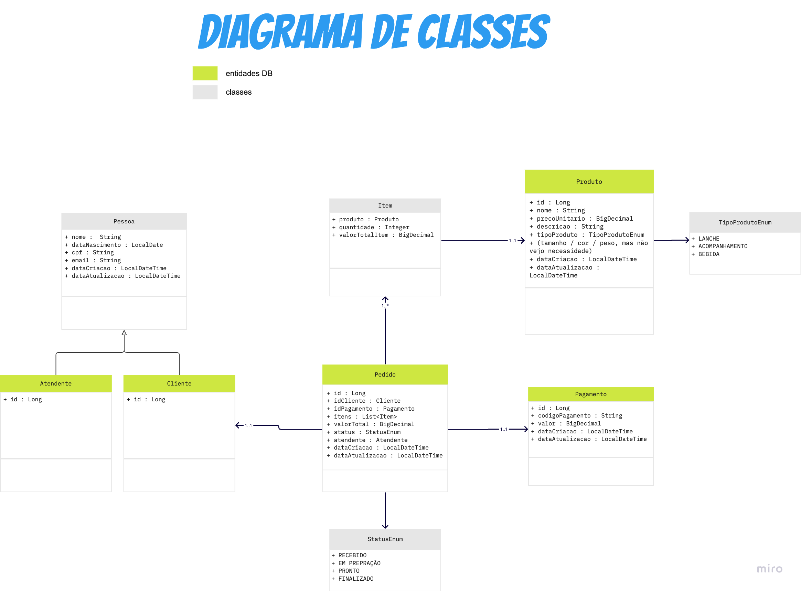
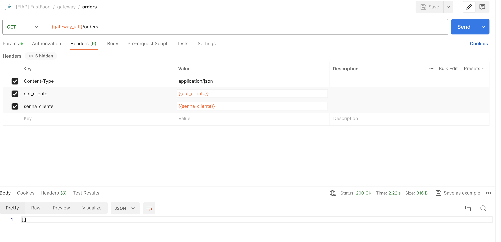

# 🚀 FIAP : Challenge Pós-Tech Software Architecture
## 🍔 Projeto Fast Food | Banco de Dados (MongoDB)

Projeto realizado para a Fase 3 da Pós-Graduação de Arquitetura de Sistemas da FIAP. Repositório para banco de dados MongoDB criado na nuvem Atlas.

**🚨 OBSERVAÇÃO 🚨**

Apesar de cofigurado o repositório, o banco de dados utilizado na execução do projeto **não foi o criado na nuvem da Atlas**, mas sim o banco de dados da entrega anterior, criado em um pod do EKS no **Repositório da App** informado mais abaixo.

A utilização deste banco demandaria a utilização de Private Endpoint (configurados, mas comentados, no arquivo atlas-pl.tf) e necessitaria de pagamento pelo uso. Optou-se por configurar, mas não utilizar a tecnologia, evitando gastos.

Erro na pipeline:
```
https://cloud.mongodb.com/api/atlas/v2/groups/6641131da90d2a046f88fd70/privateEndpoint/endpointService 
POST: HTTP 402 Payment Required (Error code: \"NO_PAYMENT_INFORMATION_FOUND\") 
Detail: No payment information was found for group 6641131da90d2a046f88fd70. 
Reason: Payment Required. Params: [6641131da90d2a046f88fd70]" timestamp=2024-05-12T19:06:08.741Z
```

### 👨‍🏫 Grupo

Integrantes:
- Diego S. Silveira (RM352891)
- Giovanna H. B. Albuquerque (RM352679)
- Kelvin Vieira (RM352728)
- Wellington Vieira (RM352970)

### 🧳 Diagrama de Classes



### 📍 DDD

Estudos de Domain Driven Design (DDD) como Domain StoryTelling, EventStorming, Linguagem Ubíqua foram feitos na ferramenta MIRO pelo grupo.
Os resultados destes estudos estão disponíveis no link abaixo:

**🔗 MIRO com DDD: https://miro.com/app/board/uXjVNMo8BCE=/?share_link_id=24975843522**

### 📐 Desenho de Solução (Arquitetura)

Solução arquitetônica realizada (Cloud AWS) completa:


### 💻 Tecnologias

Tecnologias utilizadas:

* Cloud AWS
* Terraform
* MongoDB
* Nuvem Atlas


## 🎬 Como executar este projeto?

### Rodando com CICD e infra descentralizada

Compõe esta entrega:
* Repositório da Lambda de Autenticação - https://github.com/diegosilveirabr/fiap-lambda
* Repositório da Infra - https://github.com/diegosilveirabr/fiap-infra-k8s-terraform
* Repositório da Database - https://github.com/diegosilveirabr/fiap-infra-db-terraform
* Repositório da App - https://github.com/diegosilveirabr/fiap


Faça o download ou clone este projeto e abra em uma IDE (preferencialmente IntelliJ).
É preciso ter:

    - Uma conta cadastrada na Cloud AWS
    - Uma conta cadastrada na nuvem Atlas

### 💿 Getting started - Rodando em cluster kubernetes + Load balancer + Api Gateway na AWS

Antes de iniciar:
1. Criar manualmente bucket s3 na conta com para guardar os states do terraform (utilizei o nome ‘terraform-state-backend-postech-new’)
2. Criar manualmente repositório ECR na conta com o nome ‘fiap-pos-tech-fastfood’
3. Caso não esteja usando AWS Academy, é necessário criar também Policies e Roles para os serviços. Esta etapa não foi feita na entrega da Pós e foram usadas as Roles padrão do laboratório.

Passo-a-passo:
1. Obtenha credenciais de aws_access_key_id, aws_secret_access_key e aws_session_token da AWS Lab na AWS Academy ou na sua conta AWS.
2. Altere credenciais nos secrets para actions dos repositórios
3. Altere credenciais no arquivo .credentials na pasta .aws no seu computador

> Subindo o Banco de Dados na Atlas
1. Para criar o banco de dados na nuvem atlas, utilie o **Repositório da Database**
2. Ajuste segredos de Actions para CI/CD no repositório
3. Ajuste os valores de variáveis da AWS e da nuvem Atlas no arquivo terraform.tfvars
4. Suba o banco na nuvem Atlas via CI/CD do repositório
5. Crie as collections de acordo com o script em /script/mongo-init.js
6. Obtenha a string de conexão do banco de dados na nuvem Atlas e altere na aplicação, no **Repositório da App**, no arquivo /infra-kubernetes/manifest.yaml - env DB_HOST

> Subindo a Lambda de Autenticação
1. Ajuste variáveis  e segredos de Actions para CI/CD no **Repositório da Lambda de Autenticação**
   1. Lambda Role
   2. Bucket armazenador dos states terraform -> arquivo main.tf
2. Suba a lambda via CICD do repositório

> Subindo a Infraestrutura do projeto
1. Ajuste variáveis e segredos de Actions para CI/CD no **Repositório da Infra**
   1. AccountId
   2. Nome da Lambda
   3. Arn da Lambda criada para autenticação
   4. Role Arn
   5. VPC Id
   6. VPC CIDR
   7. subnets
   8. Bucket armazenador dos states terraform -> arquivo main.tf
2. Suba infraestrutura via CICD do repositório (Api Gateway, LoadBalancer, Secuirty Group, EKS Cluster)
3. Ajuste Security Group gerado automaticamente pelo cluster para liberar tráfego da VPC (ver CIDR) e do Security Group usado no ALB (id). Liberar ‘Todo o Tráfego’.
4. Ajuste bug do autorizador do API Gateway que monstra erro 500 e mensagem ‘null’:
   1. Ir em ‘Autorizadores’
   2. Selecionar ‘lambda_authorizer_cpf’ e editar
   3. Escolher a função lambda da lista
   4. Salvar alterações
   5. Realizar deploy da API no estágio
5. Teste conexão chamando o DNS do loadbalancer na url: ``{DNS Load Balancer}/actuator/health``
6. Obtenha endereço do stage do API Gateway no console para realizar chamadas
   1. Vá em API Gateway > api_gateway_fiap_postech > estágios > pegar o valor Invoke Url

> Subindo a App
1. Abra o **Repositório da App**
2. Ajuste segredos de Actions para CI/CD no repositório
3. Ajuste URI do repositório remoto ECR AWS (accountid e region) no repositório da aplicação, arquivo infra-kubernetes/manifest.yaml
4. Suba a aplicação via CI/CD do repositório
5. Verifique componentes em execução na AWS
6. Obtenha url do estágio no API Gateway para realizar chamadas -> API Gateway / APIs / api_gateway_fiap_postech (xxxxx) / Estágios : Invocar URL
7. Para chamar o swagger da aplicação e ver os endpoints disponíveis, acesse: {{gateway_url}}/swagger-ui/index
8. Para realizar chamadas aos endpoints http do gateway, utilize os seguintes headers:
   1. cpf_cliente -> valor cadastrado previamente: 93678719023
   2. senha_cliente -> valor cadastrado previamente: FIAPauth123_

Ex. de chamada:


## Referências

[Nuvem Atlas](https://cloud.mongodb.com/)

[Tutorial Mongo Atlas](https://www.mongodb.com/developer/products/atlas/deploy-mongodb-atlas-terraform-aws/)

[Repositório de referência para cluster free-tier](https://github.com/lisenet/mongodb-atlas-terraform)

